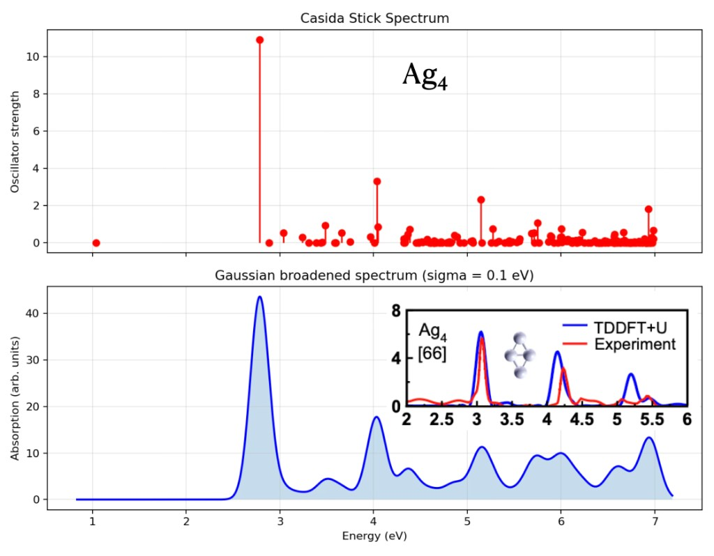
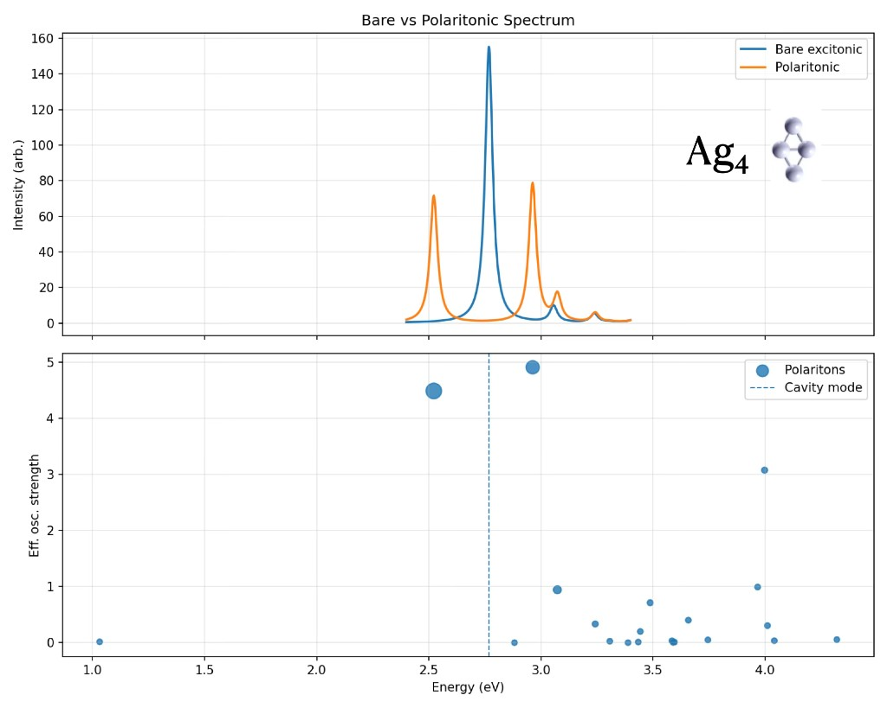
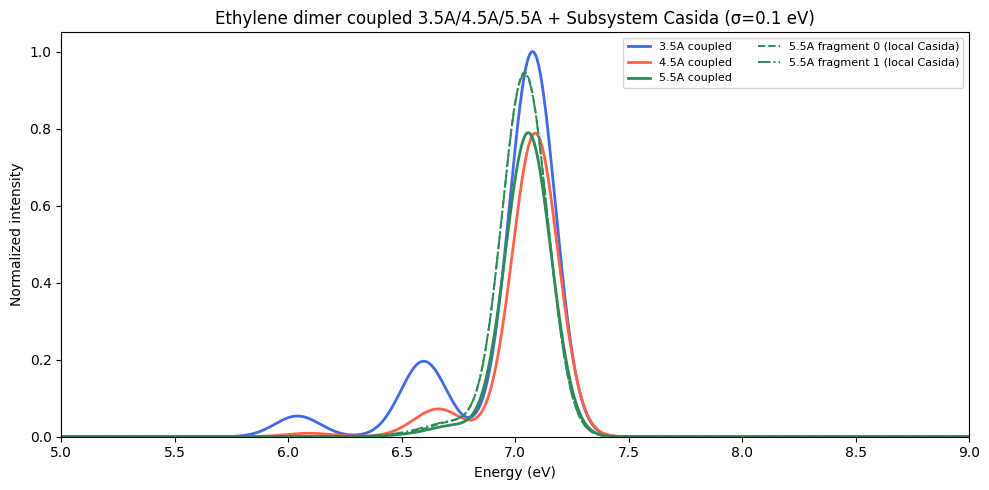

# CasidaPy

Linear-response TDDFT (Casida / RPA) for Kohn–Sham and embedded subsystem calculations. CasidaPy provides:

- **Standalone MPI Casida** from exported SCF data (density, orbitals, eigenvalues)
- **QEpy adapter** to build inputs directly from a QEpy driver
- **Subsystem coupling** (non-additive kernel) for multi-fragment eDFTpy workflows

The Python package lives in `casidapy/`. Install with pip; entry points are `casidapy-run` and `casidapy-plot`.

## Installation

```bash
cd CasidaPy
pip install .

# Optional extras
pip install qepy     # QEpy integration
```

Core dependencies: `numpy`, `scipy`, `mpi4py`, `dftpy`, `ase`.

For the full embedded workflow you also need **eDFTpy** (with `task = casida`) and **QEpy**.

## Usage overview

| Mode | When to use | Entry point |
|------|-------------|-------------|
| **CLI** (`casidapy-run`) | Single system; SCF outputs already on disk | `casidapy-run` / `scripts/run_casida.sh` |
| **Python API (PW)** | QE / DFTpy grid orbitals | `run_casida_in_memory`, `CasidaKS_MPI` |
| **Python API (GTO)** | PySCF / QMLearn MO ground states | `run_casida`, `GTOKernel` |
| **eDFTpy embedded** | Multi-fragment embedding + inter-fragment coupling | `python -m edftpy input.ini` |

Step-by-step tutorials (see [`tutorials/README.md`](tutorials/README.md)):

- **TDDFT** — `tutorials/tddft/` (H₂O high-level / stepwise / GTO↔PW / GTO patterns)
- **XAS** — `tutorials/xas/` (CVS walkthrough, Hirshfeld embedding)
- **QED** — `tutorials/qed/` (Pauli–Fierz, SF-TDA, SOC+QED)
- **SOC** — `tutorials/soc/` (C/Si/Ge atoms)

## Examples

### Standalone Casida LR-TDDFT (Ag₄)

CasidaPy run on a single Kohn–Sham ground state: stick spectrum (oscillator strengths) and Gaussian-broadened absorption (σ = 0.1 eV). The dominant transition near 2.8 eV is the main optical feature of the tetramer; the inset compares the broadened TDDFT curve with experiment.



Typical workflow: QEpy SCF → `casidapy-run` (or `run_casida.sh`) on exported `rho`, `psi`, `eigs`, and `occs`. See [§1 Standalone Casida](#1-standalone-casida-scf--casida) below.

### Polaritonic splitting (Ag₄ + cavity)

Strong coupling between the Ag₄ exciton and a cavity mode tuned near the main transition (~2.75 eV): the bare excitonic peak splits into upper and lower polariton branches (Rabi splitting). Bottom panel: effective oscillator strength of polaritonic states; dashed line marks the cavity frequency.



Enable with `--polariton` and related flags in `casidapy-run` (see `casidapy.polariton_handler`).

### Subsystem LR-TDDFT with eDFTpy + CasidaPy (ethylene dimer)

Embedded multi-fragment calculation: each monomer gets a local Casida solve on its MPI sub-communicator, then Pavanello non-additive coupling builds the coupled spectrum (σ = 0.1 eV). At **3.5 Å**, satellite peaks appear below the monomer π→π* band (~7.1 eV); as separation increases (**4.5 Å**, **5.5 Å**), those features fade and the coupled curve approaches the fragment-local Subsystem Casida lines (dashed/dotted green at 5.5 Å).



Typical workflow: `python -m edftpy input.ini` with `task = casida` and one `[SUB_FRAG_*]` block per fragment. See [§3 eDFTpy embedded subsystem Casida](#3-edftpy-embedded-subsystem-casida) below.

---

## 1. Standalone Casida (SCF → Casida)

### Step 1: Generate SCF outputs (QEpy)

Run QEpy SCF **as a single MPI rank** (QE parallelises internally; multi-rank Python launch breaks wavefunction gather for USPP).

```bash
python casidapy/generate_inputs_qepy.py \
  --geometry system.vasp --pseudo Element.UPF --workdir ./my_run
```

Expected files in `workdir`:

| File | Content |
|------|---------|
| `rho_scf_<prefix>.xsf` | Ground-state density |
| `psi_<prefix>.npy` | KS wavefunctions |
| `eig_<prefix>.npy` | Eigenvalues (Hartree) |
| `occs_<prefix>.npy` | Occupation numbers |

### Step 2: Run Casida (MPI)
```bash
casidapy-run --input-file sample_h2o_pbe.in
```

Example snippet:

```ini
workdir = ./my_run
atoms = h2o.vasp
density = rho_scf_h2o.xsf
psi = psi_h2o.npy
eigs = eig_h2o.npy
occs = occs_h2o.npy
pseudo_map = H:H_ONCV_PBE-1.2.upf,O:O_ONCV_PBE-1.2.upf
n_occ = 4
n_unocc = 30
n_states = 20
n_total_occ = 4
matrix_free
solver_method = eigsh
xc = PBE
output_prefix = casida_h2o
plot
```

### Full pipeline (one SLURM job)


Use `--skip-scf` or `--skip-casida` to run only one stage.

### Key CLI options

| Option | Description |
|--------|-------------|
| `--n-occ`, `--n-unocc` | Active occupied / unoccupied bands in the Casida window |
| `--n-total-occ` | Total occupied count (HOMO index + 1 = LUMO index). When set, the `n_occ` valence bands immediately below HOMO are used |
| `--n-states` | Number of excitation roots to solve for |
| `--matrix-free` | Avoid building the full transition matrix (recommended for large grids) |
| `--solver-method` | `lobpcg` or `eigsh` (matrix-free only) |
| `--tda` | Tamm–Dancoff approximation (no B matrix) |
| `--of-context` | OF-inspired functional context inside KS-Casida (needs `pseudo_map`) |
| `--spin-state` | `singlet` (default) or `triplet` (needs pylibxc) |
| `--use-uspp` | Ultrasoft augmentation in Casida matrix elements |

---

## 2. Python API

### One-call solver

```python
from casidapy import CasidaInputs, CasidaOptions, run_casida_in_memory
from casidapy.adapter.qepy import slice_active_space

# ... build grid, rho_ks, psi, eigs, occs ...

opts = CasidaOptions(
    n_occ=4, n_unocc=30, n_states=20, n_total_occ=4,
    matrix_free=True, solver_method="eigsh", xc="PBE",
)
inputs = CasidaInputs(atoms=atoms, grid=grid, rho_ks=rho, psi=psi, eigs=eigs, occs=occs)
results = run_casida_in_memory(inputs, opts, comm=comm)

omega_ev = results.omega * 27.2114   # Hartree → eV
f = results.f                        # oscillator strengths
```

### From a QEpy driver

Preferred (same shape as GTO)::

```python
from casidapy import extract_pw_kernel, run_casida

kernel, opts = extract_pw_kernel(driver, n_unocc=40, n_states=20, tda=True)
results = run_casida(kernel, opts)
```

CVS placeholders (occupied slots for core inject)::

```python
kernel, opts = extract_pw_kernel(
    driver, n_placeholder_occ=1, n_unocc=50, n_states=20, use_gpu=False
)
# grid = kernel.grid
```

Legacy packing into :class:`CasidaInputs` (CLI / subsystem coupling)::

```python
from casidapy.adapter.qepy import extract_casida_inputs_from_qepy_driver
from casidapy import run_casida_in_memory

inputs, opts = extract_casida_inputs_from_qepy_driver(driver, subcell, use_eDFTpy=False)
opts.n_states = 20
opts.matrix_free = True
results = run_casida_in_memory(inputs, opts, comm=comm)
```

Set `use_eDFTpy=True` when called from an eDFTpy fragment driver (charge grid, MPI-safe density broadcast).

### Kernel backends (plane-wave vs GTO)

Casida algebra (TDA/RPA eigensolve) is shared. Coupling ``K`` is provided by a backend:

| `CasidaOptions.basis` | Kernel | Ground state |
|-----------------------|--------|--------------|
| `"pw"` (default) | `PlaneWaveKernel` | QE / DFTpy real-space grid |
| `"gto"` | `GTOKernel` | PySCF / QMLearn MO coefficients |

**Plane-wave** — from a QEpy driver::

```python
from casidapy import extract_pw_kernel, run_casida

kernel, opts = extract_pw_kernel(driver, n_unocc=40, n_states=20, tda=True)
results = run_casida(kernel, opts)
```

Or via packed ``CasidaInputs`` (CLI / coupling)::

```python
results = run_casida_in_memory(inputs, opts)  # basis="pw"
```

**GTO** (molecular AO/MO) — build a kernel from PySCF, then:

```python
from casidapy import extract_gto_kernel, run_casida

kernel, opts = extract_gto_kernel(
    mf, n_occ=None, n_unocc=None, n_states=10, tda=True, xc="pbe",
)
results = run_casida(kernel, opts)
```

`GTOKernel` delegates the coupling to PySCF `mf.gen_response`, so it matches PySCF TDDFT exactly: Coulomb, singlet-adapted adiabatic f_xc, and exact exchange for hybrid / range-separated functionals (e.g. `pbe0`, `b3lyp`, `cam-b3lyp`). A plain RHF ground state gives CIS / TDHF.

| Mode | Pure GGA / LDA | Hybrid / HF |
|------|----------------|-------------|
| **TDA** (`tda=True`) | matrix-free `A` | matrix-free `A` |
| **Full TDDFT** (`tda=False`) | matrix-free Casida `C` (`A−B=diag(Δε)`) | dense `A,B` via PySCF `get_ab()` |

```python
# Full TDDFT / RPA (pure or hybrid)
kernel, opts = extract_gto_kernel(mf, n_states=10, tda=False, xc="pbe0")
results = run_casida(kernel, opts)  # hybrids automatically use dense A/B
```

Density fitting is used when `use_df=True`.

**Spin-flip TDDFT (GTO, Route A)** — collinear Mₛ = −1 manifold on a high-spin UKS/UHF reference (α-occupied → β-virtual). In that block the Hartree term and spin-diagonal `f_xc` vanish; only exact exchange survives (`K = -c_x · get_k(dm_αβ)`). That implies:

- **hybrid XC required** (e.g. `bhandhlyp`, `bhhlyp`, `pbe0`); pure functionals give zero coupling and are rejected
- **TDA only** (no RPA / full Casida)
- **dipole-forbidden** in the one-electron picture (`⟨α|r|β⟩ = 0`), so oscillator strengths are zero
- Route B (non-collinear transverse `f_xc`, `sf_xc=True`) is not implemented yet

```python
from casidapy import extract_sf_gto_kernel, run_casida, build_spin_flip_kernel

# Convenience: UKS SCF + SF kernel + CasidaOptions (tda=True)
kernel, opts = extract_sf_gto_kernel(
    mol, xc="bhandhlyp", n_states=10, use_df=False,
)
opts.solver_method = "davidson"  # or "eigsh" / "lobpcg"
results = run_casida(kernel, opts)

# Or build the kernel only (pass a converged unrestricted mf to skip SCF):
kernel, opts = extract_sf_gto_kernel(mol, xc="bhandhlyp", mf=mf)
# or: kernel = build_spin_flip_kernel(mol, xc="bhandhlyp", mf=mf)
```

Driver: `scripts/run_sf_tda.py` (CH₂ triplet or 90°-twisted ethylene).

**Nonadiabatic couplings (PySCF / gpu4pyscf wrap)** — CasidaPy does not compute
TDDFT NACs itself. Stock **PySCF** `pyscf.nac` only covers SA-CASSCF; **TDDFT**
NACs (spin-conserving LR and spin-flip) are in **gpu4pyscf**:

```python
from casidapy import solve_nac, solve_sacasscf_nac

# Linear-response TDA: states (0,1) = GS ↔ S1  (needs CUDA + gpu4pyscf)
nac = solve_nac(mf, states=(0, 1), method="tda", nstates=5)
print(nac.de)            # natm×3
print(nac.de_etf)        # with electron translation factor

# Spin-flip SF-TDA between excited roots 1 and 3
nac_sf = solve_nac(mf_uks, states=(1, 3), method="tda", spin_flip=True, nstates=5)

# CPU SA-CASSCF only (true pyscf.nac)
nac_cas = solve_sacasscf_nac(mc, states=(0, 1), use_etf=False)
```

**Projected QED NACs** — approximate polariton derivative couplings by
contracting electronic TDDFT NACVs with polariton electronic weights
(photon / ∂g/∂R terms neglected). Electronic NACs need gpu4pyscf (GPU);
QED + projection can run on CPU:

```python
from casidapy import (
    solve_qed_post, compute_electronic_nac_tensor, solve_qed_projected_nac,
)

# 1) electronic NAC tensor (GPU): indices 0=GS, 1..=excited
d_el = compute_electronic_nac_tensor(td, n_excited=5, which="de")

# 2) post-process QED on Casida results (CPU)
qed = solve_qed_post(casida_res, lam_vec=lam, omega_c=omega_c, model="pf")

# 3) project onto polariton pair (I, J)
nac_qed = solve_qed_projected_nac(qed, d_el, states=(1, 2))
print(nac_qed.de)  # natm × 3
```

**Spin-flip projected QED NACs** — same projection, but SF electronic
NACs are **excited–excited only** (gpu4pyscf has no SF ground–excited NAC),
and weights come from QED-SF-TDA amplitudes projected on Casida SF
eigenvectors (`C = ZᵀX₀ + ZᵀX₁`):

```python
from casidapy import (
    extract_sf_gto_kernel, run_casida, solve_qed_sf_tda, QEDOptions,
    compute_electronic_nac_tensor, solve_qed_projected_nac, build_tddft,
)

kernel, opts = extract_sf_gto_kernel(mol, xc="bhandhlyp", n_states=5)
cas = run_casida(kernel, opts)
qed = solve_qed_sf_tda(kernel, options=QEDOptions(
    lam_scalar=0.05, polarization=(0, 0, 1), omega_c=0.1, nstates=8,
))

# SF electronic NAC tensor on GPU (local 0 = first SF root)
td_sf = build_tddft(mf_uks, method="tda", spin_flip=True, nstates=5)
d_sf = compute_electronic_nac_tensor(td_sf, n_excited=5, spin_flip=True)

nac_sf = solve_qed_projected_nac(qed, d_sf, states=(0, 1), casida=cas)
```

Note: CasidaPy SF is collinear Route A; gpu4pyscf SF NACs are often
multicollinear — manifolds may differ slightly.

Or assemble `d_el` yourself with `assemble_electronic_nac_tensor` if NACVs
were precomputed. Dense `solve_qed_tda` results also work if you pass
`casida=` with eigenvectors `Z`.

**QED-SF-TDA** — cavity coupling on the SF manifold via the dipole-*difference* matrix `Δd` between SF configurations (Slater–Condon: `I⊗Q_vv − Q_oo⊗I`), not the spin-forbidden `⟨α|r|β⟩`. The Hamiltonian is the QED-SF-CIS block form on SF singles ⊗ {0,1} photons (`2 n_trans` dense matrix). DSE/CS are off by default.

```python
from casidapy import extract_sf_gto_kernel, solve_qed_sf_tda, QEDOptions

kernel, _ = extract_sf_gto_kernel(mol, xc="bhandhlyp", use_df=False)
kernel.setup(tda=True)
opts = QEDOptions(lam_scalar=0.05, polarization=(0, 0, 1), omega_c=0.1, nstates=8)
res = solve_qed_sf_tda(kernel, options=opts)
# res.X[:n] = 0-photon SF amplitudes; res.X[n:] = 1-photon; res.photon_frac
```

**Performance:** when `n_trans <= k_cache_max` (default 4096), `setup()` precomputes the full K matrix using batched `gen_response` calls — a few AO-integral passes total instead of one per solver iteration — after which every matvec is a DGEMM. For larger active spaces, matvecs are evaluated on the fly. PySCF's integrals and grid quadrature are OpenMP-threaded; set `OMP_NUM_THREADS` to the core count for intra-node parallelism (MPI does not help the GTO path). `GTOKernel.dense_K_rows` also plugs into the engine's MPI dense build (`build_matrices`), same as the plane-wave backend.

### Stepwise control (`CasidaKS_MPI`)

See `tutorials/tddft/h2o_tddft_approach2_stepwise.ipynb` for the explicit sequence:

1. `slice_active_space(eigs, psi, n_occ, n_unocc, n_total_occ=...)`
2. `casida.set_active_orbitals(...)`
3. `casida.setup_matrix_free()` or `casida.build_matrices()`
4. `casida.solve_matrix_free(k=n_states)` or `casida.solve(k=n_states)`
5. `casida.oscillator_strengths(k=n_states)`

### Active-space windowing

`slice_active_space` is the single source of truth for orbital windows:

- **`n_total_occ=None`**: use the lowest `n_occ` bands as occupied; unoccupied from index `n_occ` upward.
- **`n_total_occ` set**: LUMO is band `n_total_occ`. Occupied window is bands `[n_total_occ - n_occ, n_total_occ)` (the top `n_occ` occupied states). Unoccupied from `n_total_occ`.

When using the QEpy adapter without overrides, `n_occ` / `n_unocc` are inferred from occupation numbers (`> 0.01` / `< 0.01`).

### CVS core XAS (AE cores → real host virtuals)

For K/L/M-edge spectra, import all-electron core MOs into a Casida host whose
**virtuals are real** (molecular GTO or QEpy PW). Under CVS the occupied active
space is core-only (core–valence K coupling neglected).

**Molecule / GTO host** — run your own SCF, then:

```python
from casidapy import core_from_mf, run_cvs_gto_from_mf

# mf = your converged pyscf RKS/RHF (DF, gpu4pyscf, x2c, …)
res, core, kernel = run_cvs_gto_from_mf(
    mf, edge="K", edge_atom_indices=[0], n_unocc=80, n_states=80
)
# or: core = core_from_mf(mf, edge="K", edge_atom_indices=[0])
```

**PW host** — keep QE/QEPy virtuals; inject GTO cores onto the grid:

```python
from casidapy import (
    select_xas_fragment,   # auto neutral first shell, or user indices
    FragmentSpec,
    extract_fragment_core,  # or core_from_mf(your_mf, ...)
    core_mos_to_pw_fields,
    inject_core_orbitals,
    extract_pw_kernel,
    run_cvs_tda,
)

# Auto: edge atom + bonded shell + ligands until formal charge ≈ 0
frag = select_xas_fragment(atoms, edge_atom=0, mode="neutral_first_shell")
# User-defined cut (indices into the parent geometry):
# frag = FragmentSpec.user([0, 1, 2, 5], charge=0, edge_atom_indices=[0])
# frag = select_xas_fragment(atoms, edge_atom=0, atom_indices=[0, 1, 2, 5], charge=0)

core = extract_fragment_core(
    mol_ae, fragment=frag, edge="K", basis="def2-tzvp", xc="pbe",
)
pw_kernel, opts = extract_pw_kernel(
    driver, n_placeholder_occ=1, n_unocc=50, n_states=20, use_gpu=False
)
fields = core_mos_to_pw_fields(core, pw_kernel.grid)
inject_core_orbitals(pw_kernel, core.energies, fields)
res = run_cvs_tda(pw_kernel, opts)
```

Override oxidation numbers with ``oxidation_states={"Ti": 4, "O": -2}`` if needed.
``select_atoms_in_radius`` / ``mode="radius"`` remain available for plain distance cuts.

``build_pw_kernel_from_qepy(driver, n_virt=...)`` remains as a thin alias returning ``(kernel, grid)``.

**AE reconstruction in frozen QE ``V_KS``** — strip the edge atom's local PP,
SCF the electrons the PP removed (``n_frozen = Z − z_valence``), inject the
edge orbital:

```python
from dftpy.functional.xc import XC
from casidapy import CasidaKS_MPI

rho = driver.data2field(driver.get_density())
casida = CasidaKS_MPI(rho, XC(xc="PBE"), driver=driver)
# Optional: use_gpu=True (CuPy), comm=MPI.COMM_WORLD for Hirshfeld / AO grid
res, core, kernel, mf = casida.xas(
    reconstruct=True, edge_atom=0, basis="def2-tzvp", use_gpu=False, comm=None
)
```

Or the functional form::

```python
from casidapy.xas import run_xas_reconstruct
res, core, kernel, mf = run_xas_reconstruct(
    driver, edge_atom=0, edge="K", use_gpu=False, comm=None
)
```

L-edge: use `edge="L", soc=True` to diagonalize Breit–Pauli SOC in the 2p subspace before injection (j-adapted energies). This is **orbital** SOC on the fragment, distinct from valence state-interaction SOC in `casidapy.utils.soc`.

---

## 3. eDFTpy embedded subsystem Casida

For multi-fragment embedded DFT, eDFTpy drives SCF embedding, per-fragment Casida (via CasidaPy in each subsystem MPI communicator), and Pavanello coupling on the global grid (rank 0).

```bash
mpirun -n 10 python -m edftpy input.ini
```

Minimal `.ini` structure:

```ini
[JOB]
task = casida

[TD]
number_of_states   = 10
number_of_bands    = 40      # must match QE nbnd
coupling_energy_threshold = 0.001   # Ha; drop weakly coupled fragment states
matrix_free = true
solver_method = eigsh
casida_plot_txt = casida_merged_system.txt

[GSYSTEM]
cell-file = system.xyz
exc-xc = PBE
grid-ecut = 8163.5

[SUB_FRAG_0]
calculator = qe
embed = KE XC
cell-cut = 5.5 5.5 5.5
cell-index = 0:12
basefile = qe_system.in
decompose-method = manual

[SUB_FRAG_1]
calculator = qe
...
```

**MPI layout:** ranks are split across fragments (e.g. `[5, 5]` for two subsystems on 10 ranks). Each fragment runs Casida on its `comm_sub` in parallel; a WORLD barrier precedes gather/coupling on rank 0.

**Outputs:**

- Per-fragment sticks in the log (`Subsystem N Casida: omega`, `f`)
- `casida_merged_*.txt` — coupled + uncoupled merged spectrum
- `casida_uncoupled_*.txt` — fragment-local states only

**Tuning `coupling_energy_threshold`:** threshold in Hartree on fragment excitation energies before coupling. Lower values keep more charge-transfer states in the coupled problem; very large values couple everything (often unphysical for distant fragments).

CasidaPy coupling implementation: `casidapy.subsystem_coupling.run_subsystem_casida`.

---

## 4. Plotting

```bash
# Broadened spectrum from casida output text
casidapy-plot --input casida_h2o.txt --sigma 0.1 --output spectrum.png

# Uncoupled / merged comparison (eDFTpy outputs)
python -m casidapy.plot_uncoupled_spectrum --help
```

---

## 5. Package layout

```
casidapy/
  casida_api.py          # CasidaInputs, CasidaOptions, CasidaResults
  casida_engine.py       # CasidaKS_MPI, run_casida_in_memory, run_casida
  kernels/
    base.py              # KernelBackend protocol
    plane_wave.py        # PlaneWaveKernel (FFT grid / QE)
    gto.py               # GTOKernel (PySCF AO/MO)
  adapter/               # external backends
    qepy.py              # extract_pw_kernel, slice_active_space, …
    pyscf.py             # extract_gto_kernel, spin-flip helpers
    stddft.py            # STDDFTBridge
    mpi_pyscf.py         # mpi4pyscf helpers
  utils/                 # shared numerical utilities
    casida_utils.py      # transitions, normalization, MPI helpers
    davidson.py          # Davidson / LOBPCG / eigsh (matrix-free)
    nac.py / nac_gto.py  # nonadiabatic couplings
    qed.py               # Pauli–Fierz QED-TDA
    soc.py               # spin–orbit coupling
    uspp.py              # ultrasoft projectors and augmentation
  xas/                   # XAS/CVS package
    __init__.py          # facade (run_xas_gto, run_xas_reconstruct, plot_sticks)
    cvs.py               # CoreOrbitals, inject, CVS-TDA
    reconstruct.py       # AE core in V_env → PW CVS
    spectrum.py          # stick plots / summarize
  embed/                 # AE embedding potentials
    __init__.py          # build_ae_embedding_potential, build_hirshfeld_embedding
    potential.py         # V_ionic = vltot − V_loc(A); embed_mode dispatch
    hirshfeld.py         # w_A · ρ_tot → v_Hxc[ρ_env]
  subsystem_coupling.py  # Pavanello coupling, run_subsystem_casida
  run_casida_parallel_generic.py  # casidapy-run CLI
  generate_inputs_qepy.py         # SCF export for standalone workflow
  plot_casida_spectrum.py         # casidapy-plot
  polariton_handler.py   # optional polariton extensions
scripts/                 # run_sf_tda.py, run_qed_formaldehyde.py, SOC/QED PES, SLURM wrappers
tutorials/               # see tutorials/README.md (tddft/, xas/, qed/, soc/)
tests/                   # pytest unit tests
```

## Tests

```bash
pip install -e ".[all]"
pytest tests/ -v
```

## License

MIT — see `LICENSE`.
